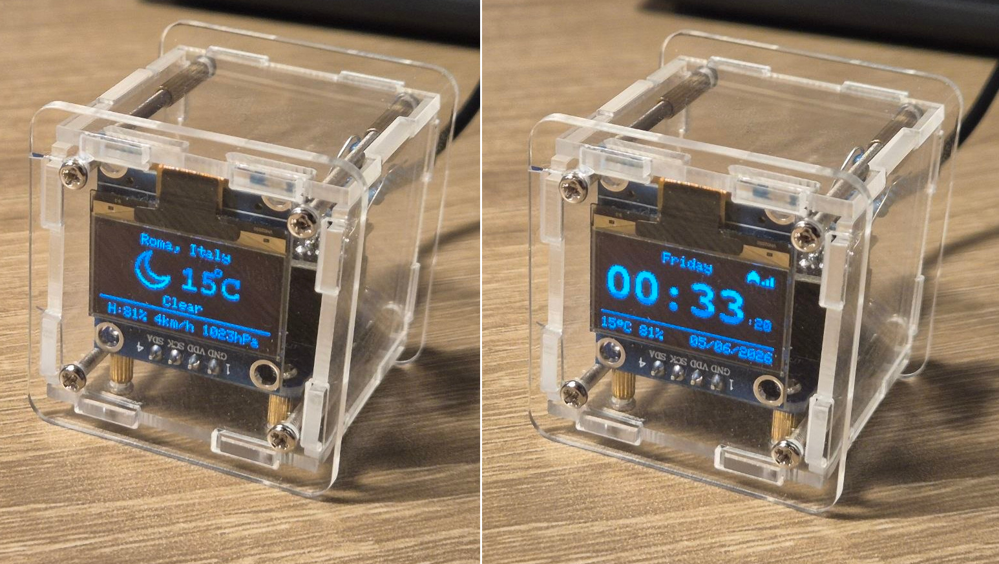
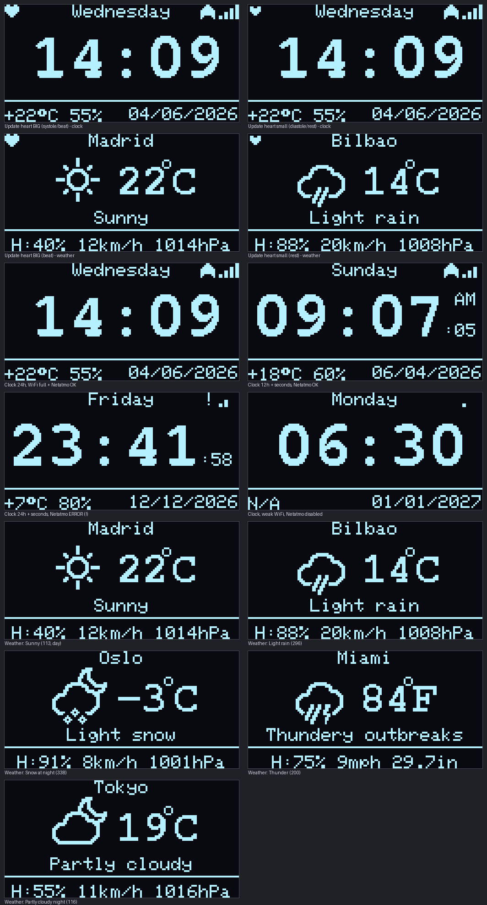
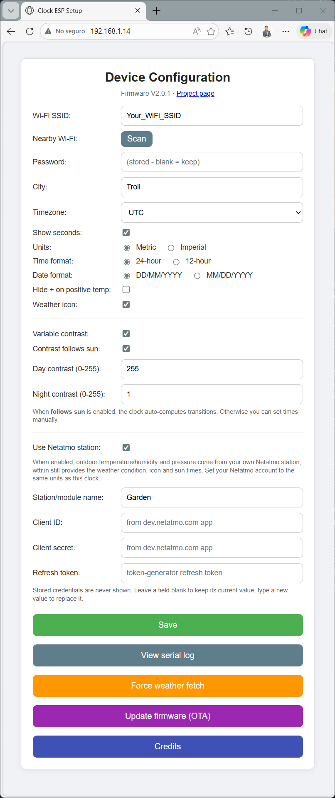
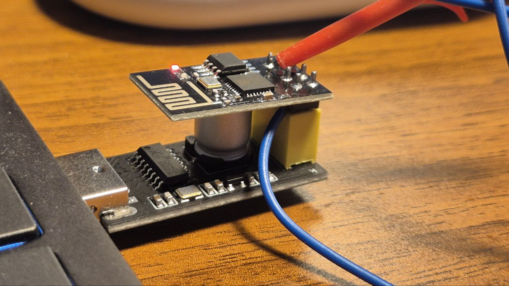

# DIY-Weather-Clock-Firmware

This is an Alternative firmware for the DIY Weather Clock WiFi kit that can be easily found on Amazon
or AliExpress. The kit includes a plexiglass structure and three PCB boards:

- An ESP-01S module with an ESP8266 MCU
- An Adafruit OLED display (0.96", 128x64 px)
- An interface PCB that is usually hand-soldered

 Clock Face on the left, Weather face on the right

## Why
This kit already ships with a ready-to-use firmware, but it requires registering
on an external website and you have no real control over what the firmware does
or what data it sends.

In the original [WHYNOT blog](https://www.whynot.org.ua/en/electronic-kits/hu-061-diy-kit-wi-fi-weather-forecast-clock) you can find more information about this kit and its
firmware. This project started as a fork of that firmware, and has been heavily
modified and cleaned up to:

- remove external dependencies
- fix several corner cases
- add proper configuration and robustness
- support metric / imperial units
- support real automatic daylight-saving time (DST)
- support weather icons
- support for **Netatmo** weather stations (this is optional)

 Different Faces examples showing different possible customizations

## How it works

On first boot, the firmware looks for a magic signature in EEPROM.

If the signature is not found:
- The device starts in Access Point (AP) mode
- The OLED display shows connection instructions
- You connect to the AP and open the configuration web portal
- You configure:
  - Wi-Fi credentials (a **Scan** button lists nearby networks so you don't have to type the SSID)
  - City (used for weather)
  - Timezone (preset or manual)
  - Metric / imperial units
  - Pressure unit (hPa or mmHg)
  - Optional 48-hour Netatmo pressure trend screen
  - Seconds display
  - Optionally, a **Netatmo** weather station (see the Netatmo section below)

 Configuration web screenshot

Once configured and rebooted:

- The clock connects to your Wi-Fi network
- Time is synchronized using NTP pool servers
- Timezone handling uses proper DST rules (not fixed offsets)
- Weather data is retrieved from wttr.in every 15 minutes
- If Netatmo is enabled, the outdoor temperature/humidity and pressure are taken
  from your own station instead, also every 15 minutes (the condition, icon and sun times still come
  from wttr.in)
- The configuration web portal stays available at the device's **IP (shown on the OLED at boot for 8 seconds)**, so you can reconfigure it from a browser at any time — no need
  to force AP mode or re-flash
- The device's serial log is kept in a small RAM buffer and can be viewed from a
  web page, so you can debug the clock over Wi-Fi without a serial cable.
- Successful wttr.in updates log temperature, localized condition, humidity,
  wind, pressure and the WWO code; periodic sun-data responses also log dawn,
  sunrise, sunset and dusk.
- Firmware can be updated over the air (OTA): once it is running, you can upload a
  new `.bin` from a browser at `http://<device-ip>/update`, so you only need the
  USB/FTDI cable for the very first flash
- On boot (and once a day) the clock checks GitHub for a newer firmware version and
  lets you know if one is available (see the update-notification section below); it
  never flashes anything on its own

Every 15 seconds the display toggles between:
- Clock view
- Weather view
- 48-hour pressure trend view (when enabled and Netatmo pressure is available)

If weather retrieval fails (no internet, server down, etc.), the device keeps
showing the clock only.

If the internet goes away for hours and later comes back, the ESP reconnects
automatically without rebooting.

## Changes from the original firmware

- Metric / Imperial units selection
- Pressure display in **hPa or mmHg** (handy where mmHg is the norm, e.g. Russia)
- Optional **48-hour pressure trend** chart using Netatmo readings, with a
  labelled pressure scale, current value, elapsed period, delta, minimum and maximum
- Proper timezone handling with automatic DST
- Optional seconds display
- Support for cities with spaces and special characters
- Weather hidden when not available
- Weather condition icon on the weather screen, with day/night variants (can be turned off)
- More display options: 12/24-hour time, DD/MM/YYYY or MM/DD/YYYY date, hide the '+' on positive temperatures
- Configuration web portal always reachable on the network (reconfigure anytime)
- Wi-Fi network scanner in the config portal (pick your SSID from a list)
- Optional **Netatmo** integration: show outdoor temperature/humidity and pressure
  from your own weather station
- Status icons on the clock screen: a Wi-Fi signal meter and a Netatmo health mark
- Serial log viewable from a web page (remote debugging without a cable)
- Over-the-air (OTA) firmware updates from a web page (no cable after the first flash)
- Automatic **update notification**: the clock checks GitHub for a newer version and
  tells you (on the OLED, with a beating-heart icon, and on the config page)
- More predictable behavior

## Netatmo (optional): use your own weather station

By default the clock gets all its weather from [wttr.in](https://wttr.in). If you
own a [Netatmo](https://www.netatmo.com/) Weather Station you can have the clock
show **your own measurements** instead: outdoor **temperature** and **humidity**
(from the outdoor module) and **pressure** (from the indoor base station). The
weather **condition**, the **icon** and the **sunrise/sunset** times still come
from wttr.in — Netatmo doesn't provide those — so the two work together.

If Netatmo is unreachable, the clock automatically falls back to the wttr.in
values, and the clock screen shows a small `!` next to the Wi-Fi meter (it shows
a Netatmo "OK" (Netatmo icon) mark when the last update succeeded).

### One-time setup at Netatmo

Netatmo requires an OAuth2 app and a token. You create these once on Netatmo's
developer site:

1. Sign in at **https://dev.netatmo.com** with your normal Netatmo account.
2. Go to **My Apps** and create an app (any name/description). Open it and note
   its **Client ID** and **Client secret**.
3. On the same app page, use the **Token generator**: tick the **`read_station`**
   scope and generate a token. Copy the **refresh token** it gives you.
   (The clock only needs the refresh token; it mints short-lived access tokens
   from it automatically, and refreshes them every ~3 hours on its own.)

> :warning: Treat the Client secret and refresh token like passwords — don't
> share or commit them. If you ever leak them, regenerate the token / app.

### Configure the clock

Open the config portal (the AP `Clock-ESP01-Setup` on first setup, or the
device's IP afterwards) and:

1. Tick **"Use Netatmo station"**.
2. **Station/module name**: the name of your **outdoor module** as it appears in
   the Netatmo app (e.g. `Terraza`, `Outdoor`, `Jardin`). Use an ASCII name
   (accents like `Salón` aren't matched). Leave blank to use the first station.
3. Paste the **Client ID**, **Client secret** and **Refresh token**.
4. Save. The clock reboots and starts overlaying your station's readings.

Notes:
- **Units:** Netatmo returns values in your Netatmo account's unit setting, used
  as-is. Set your Netatmo account to the same temperature units (°C / °F) as the
  clock, and its pressure to **mbar** (= hPa) — the clock then shows it in hPa or
  mmHg according to the **Pressure unit** option, whichever the source.
- For security the three credentials are **never shown back** in the portal:
  leave a field blank to keep the stored value, or type a new value to replace
  it (the Wi-Fi password works the same way).
- The refresh token is rotated by Netatmo on every refresh; the clock saves the
  new one automatically, so you don't need to touch it again.

### 48-hour pressure trend screen

When Netatmo is enabled, the configuration portal can add a third screen to the
15-second display rotation. Enable **Pressure trend screen** and reboot the clock.
The screen appears after the first successful Netatmo pressure reading.

The clock records one pressure point every 30 minutes and keeps 96 readings in
RAM. Every sample is plotted, giving the complete 48-hour chart half-hour
resolution.
The trace fills from left to right, uses one horizontal pixel per sample and is
two pixels thick vertically for readability. A 3x3 marker identifies the newest
reading.

The `48H` label in the centre of the header makes the displayed history period
explicit. Three short ticks divide the horizontal axis into 12-hour intervals.
The pressure scale is rounded to 5-unit boundaries and always spans at least
10 mmHg or 10 hPa. This keeps small changes proportional rather than stretching
minor sensor movement over the full screen height. The header shows `PRESSURE`
and the current value. A dedicated footer shows minimum, delta and maximum;
`MIN:` and `MAX:` have a two-pixel gap before their values. The Y-axis uses the
readable classic 5x7 digits.
Two-pixel ticks extend left from the top and bottom of the Y-axis to mark the
exact positions represented by its two scale labels. The axis is offset far
enough to retain a two-pixel gap between the ticks and digits.
The footer colons use larger 2x2-pixel dots with extra vertical separation so
they remain as legible as the surrounding capital letters, aligned one pixel
above the footer text origin to match the letters visually.
Minimum, maximum and delta are calculated from the same original 30-minute
samples shown by the line.

Pressure history is deliberately kept in RAM to avoid frequent EEPROM flash
writes. It therefore starts over after a reboot, power loss, or OTA update.

### Live web screen

Open `http://DEVICE-IP/screen` or select **Live screen** on the configuration
page to see a pixel-perfect enlarged copy of the physical OLED. The browser
requests the existing 1024-byte SSD1306 framebuffer once per second and renders
it on a 128x64 Canvas with pixel smoothing disabled. No duplicate framebuffer is
allocated on the ESP-01. The Canvas applies the same 180-degree orientation as
the physical OLED.

The web interface has no Internet-grade authentication. Use it only on a trusted
local network or through a VPN; do not forward the ESP web-server port directly
to the Internet.

### Russian OLED language

Select **Display language: Russian** on the configuration page to request the
weather description from wttr.in in Russian and use full Russian weekday names
on the OLED. If wttr.in nevertheless returns an English condition, the firmware
selects a Russian description locally from the numeric WWO weather code. The
compact `MIN`/`MAX` pressure labels remain English. The firmware includes its own compact 5x7
Cyrillic alphabet and UTF-8 decoder; long conditions are shortened to 21 glyphs
with an ellipsis. The language radio buttons apply and persist the selection
immediately, refresh the localized forecast, and do not reboot the clock, so
the in-memory pressure history is retained. The web configuration interface
itself remains English.

The optional **Display city** field can contain a localized OLED-only name such
as `Томск`. Keep **City** as the reliable wttr.in lookup value (for example,
`Tomsk`). In Russian mode the localized name is shown with the Cyrillic font;
in English mode the original lookup name is shown. Leaving the field applies
and stores it immediately without rebooting or clearing pressure history.

After every successful SNTP synchronization, `/log` lists the configured time
servers with their resolved IP addresses and lwIP reachability values. This also
makes a local NTP source supplied by DHCP (for example a GPS receiver) visible.

V2.3.2 uses an 8 KB TLS receive buffer when the Netatmo server does not offer
MFLN. This avoids `HTTP -1` token-refresh failures caused by a fragmented ESP-01
heap. Negative HTTP results now also include the connection error and free heap
in the device log.

## What you need to compile and install

Hardware:

- You can use a generic FTDI adapter, but it MUST be set to 3.3V
  (never use 5V, you will kill the ESP-01)
- Much easier: use an ESP-01 USB adapter (cheap to find in internet)
- To flash the firmware, the ESP must be in UART flash mode:
  - GPIO0 connected to GND during power-up
- Some ESP-01 boards (if you don't use the original) do not include a pull-up on GPIO2
  - This can cause random behavior when installed on the Clock.
  - Fix: solder a 12 kΩ pull-up resistor between GPIO2 and 3.3V

> :warning: FTDI you must configure it to 3.3V

> :warning: GPIO0 must be connected to GND at power up to enter in UART Flashing mode. See image attached here.

> :warning: GPIO2 needs a 12kohm pullup if you use another ESP-01 module that is not coming from the clock DIY kit.

 ESP-01 USB adapter board with the ESP-01 connected and the GPIO0 connected to GND to enter in programming mode.

Software:
- Download and install Arduino IDE: https://www.arduino.cc/en/software/

- Install the ESP8266 board package:
  - File -> Preferences
  - Add to "Additional Boards Manager URLs": https://arduino.esp8266.com/stable/package_esp8266com_index.json
  - Tools -> Board -> Boards Manager...
  - Search for ESP8266
  - Install "esp8266 by ESP8266 Community"
  - Select board: "Generic ESP8266 Module"

- Clone this repository into your Arduino sketch folder
- Install required libraries using the Arduino Library Manager:
  - Adafruit SSD1306 (by Adafruit)
  - Adafruit GFX Library (by Adafruit)
  - Any dependencies pulled by those libraries
- Before compiling, set the flash layout so OTA updates fit (see warning below):
  - Tools -> Flash Size -> **"1MB (FS:none OTA:~502KB)"**
- Compile and upload the firmware

> :warning: You MUST select **Flash Size = "1MB (FS:none OTA:~502KB)"** in the
> Tools menu. This firmware uses no filesystem, so this layout reclaims that space
> for the program and leaves ~500KB free for the new image during an OTA update.
> Any other 1MB layout (the default reserves 256KB for a filesystem) leaves almost
> no room for OTA and the `/update` page will reject the new firmware. If you build
> with PlatformIO instead, this is already handled by `platformio.ini`
> (`board_build.ldscript = eagle.flash.1m.ld`).

### Building with PlatformIO (VS Code)

If you prefer VS Code, the repo ships a `platformio.ini`, so you don't need the
Arduino IDE, and the flash layout for OTA is already set for you:

1. Install [VS Code](https://code.visualstudio.com/) and the **PlatformIO IDE** extension.
2. Open this repository folder in VS Code — PlatformIO picks up `platformio.ini`
   automatically and downloads the toolchain and libraries (Adafruit SSD1306 + GFX)
   on the first build.
3. Build / flash / monitor from the PlatformIO toolbar, or from a terminal:
   - Build: `pio run`
   - Flash over USB/FTDI (first time only, ESP in flash mode): `pio run -t upload`
   - Serial monitor: `pio device monitor` (115200)

The target board is `esp01_1m` (ESP-01S, 1 MB flash). After the first USB flash you
can update over Wi-Fi from the `/update` page (see below).

## Updating over the air (OTA)

You can use OTA only if you managed to update the firmware beforehand already. You cannot do OTA over the original firmware. So, after the firmware is running, you will no longer need the USB/FTDI cable to update it to future versions:

1. Build the new firmware and locate the binary:
   - Arduino IDE: **Sketch -> Export Compiled Binary**, then grab
     `DIY-Weather-Clock-Firmware.ino.bin`
   - PlatformIO: `.pio/build/esp01_1m/firmware.bin`
2. Open `http://<device-ip>/update` in a browser (the device IP is shown on the
   OLED at boot, and there is also an "Update firmware (OTA)" button on the
   configuration page).
3. Upload the `.bin`. The clock flashes it and reboots into the new version. Your
   saved configuration in EEPROM is preserved.

> :warning: The very first flash must still be done over the USB/FTDI cable — the
> factory firmware does not have the OTA update page.

### Update notifications

The clock can tell you when a newer firmware is available so you don't have to
check by hand. Right after boot (once the first weather data is in) and then once
every 24 hours, it fetches a tiny [`firmware/latest.json`](firmware/latest.json)
from this GitHub repo over HTTPS and compares its version with the one running.

If a newer version exists, it lets you know in three places:

- an **8-second notice on the OLED at boot**, showing the new version and the
  device's `http://<ip>/update` address;
- a **beating-heart icon** in the top-left corner of both the clock and weather
  screens;
- a **red banner** at the top of the configuration web page, with an *Update now*
  link straight to the `/update` page.

It **never flashes anything by itself** — updating is always your manual OTA
(upload the new `.bin` at `/update`). `latest.json` is published automatically
from the firmware version on each release, so it always reflects the latest build.

## Tools

Two small Python helpers live under [`tools/`](tools/) and are **not** part of the
firmware build:

- [`tools/icon_sim/`](tools/icon_sim/README.md) — preview the weather icons and
  regenerate `weather_icons.h`.
- [`tools/screen_sim/`](tools/screen_sim/README.md) — a bit-for-bit simulator of the
  128×64 OLED that mirrors both screens (icons, status marks, the update heart…),
  so you can preview layout changes without flashing hardware.

## Resources
- Original firmware and inspiration: https://www.whynot.org.ua/en/electronic-kits/hu-061-diy-kit-wi-fi-weather-forecast-clock
- Huge thanks to wttr.in for providing free weather data: https://github.com/chubin/wttr.in
- Weather icons by Dhole (pixel weather icons, CC BY-SA 4.0): https://github.com/Dhole/weather-pixel-icons
- In your source website for DIY projects just search for "ESP8266 DIY" or "weather clock diy" to find the hardware, usually for less than 10€

Simple clock, honest code.
Less magic, more control.
